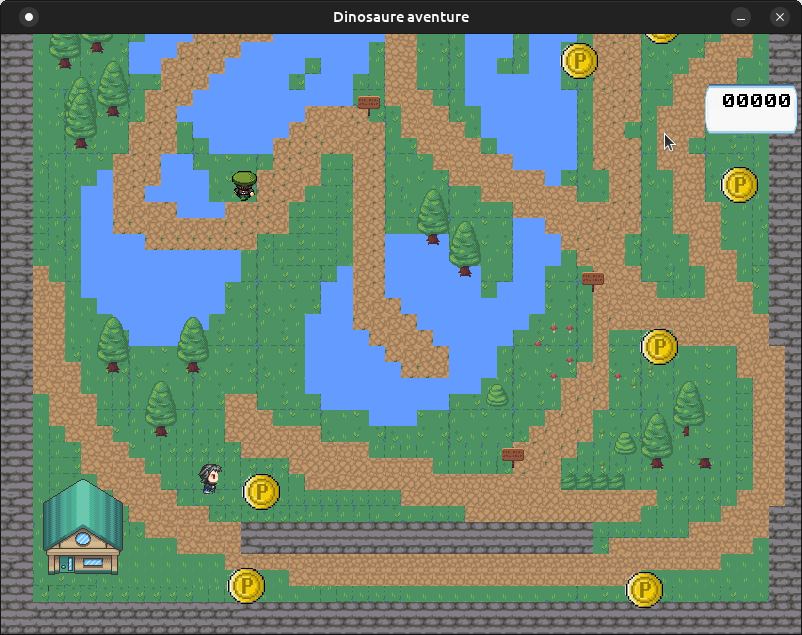

# Yet Another Pygamon

Fortement inspiré d'une vidéo par [Graven](https://www.youtube.com/watch?v=ooITOxbYVTo&t=1317s).

# Views

# Starting the game
1) Download this files.
2) You need Python 3 and some librairies: pygame, pyscroll, pytmx.
3) start `/src/main.py`.

# Credits : 
### Dungeon Tileset
Itch.io dungeon tileset
[https://stealthix.itch.io/dungeon-tileset-32x32-px](https://stealthix.itch.io/dungeon-tileset-32x32-px)

### PNJ assets
[/assets/pnjs](/assets/pnjs)
Source : 
Artist : [DoubleLeggy](https://www.deviantart.com/doubleleggy/)

### Dialogs assets
[/assets/dialogs](/assets/dialogs)

### Music by : 
  * Music : by Syncopika
    * [happy-tune](https://opengameart.org/content/happy-tune)  https://opengameart.org/content/happy-tune
    * [happy-bgm-pianoviolinflutedrums](https://opengameart.org/content/happy-bgm-pianoviolinflutedrums)
  * Sounds are from [pymage](https://www.pygame.org/contribute.html)
# Tags of releases

* 0.01
* v0.1
* v0.2
* v0.3 : maybe unstable
* v0.4 : add music and sounds. 